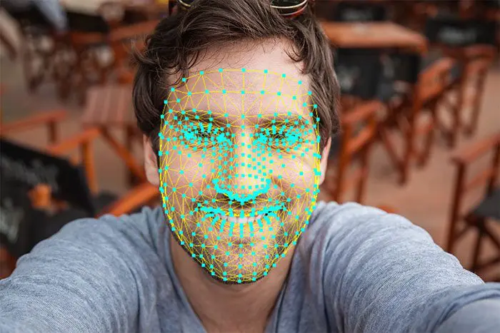
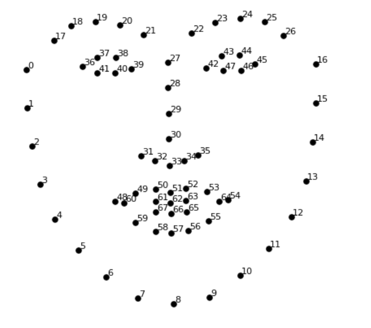

# Facial Motion Capture 

The program works by detecting a face using a normal camera/web-cam, detecting facial landmarks represented as marks or dots on the main areas of movement 
on the face, it gets the location of each marker and send these coordinates to a 3D application loaded with the plugin for this program in real time using
a low-latency protocol "OSC". The plugin then maps in real time the facial movement of the real face to a facial-rig of a 3D model which can then be animated
and captured using standard key-frame recording, providing accurate and improved facial animations.

## Point Chart

The points on the face can be customized, all points have numbers associated with them and can be changed using the chart below.

## Networking Configurations

As mentioned previously, the points are sent over a network, the configurations of the receiving host and the port can be found in configs.h
